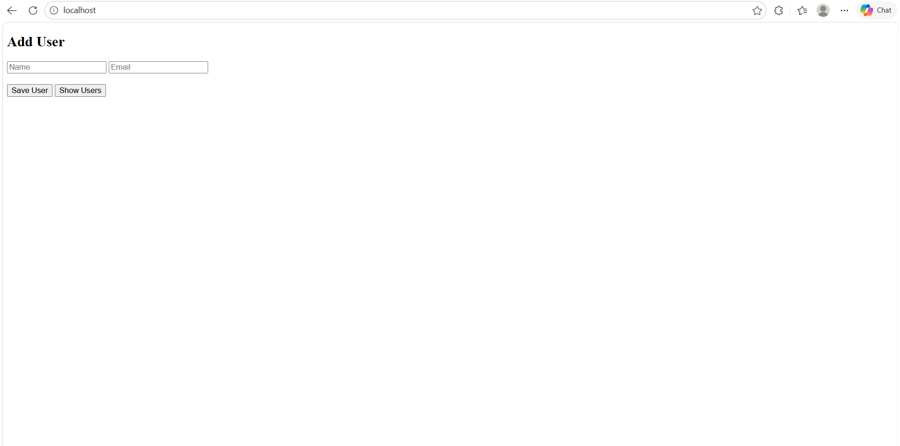
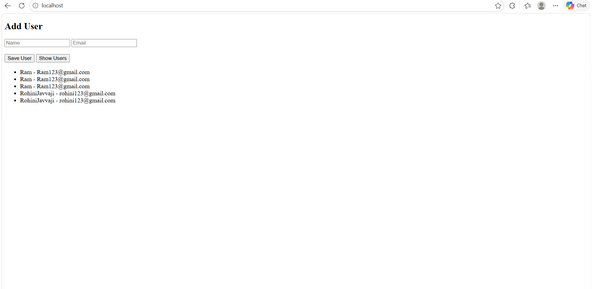
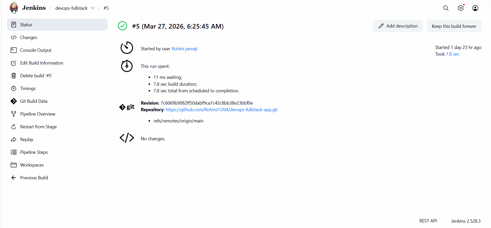
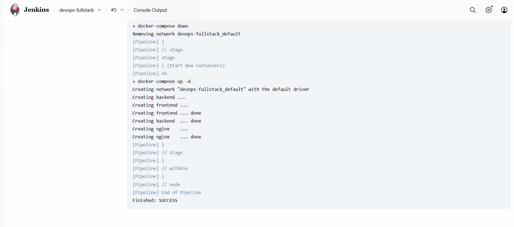
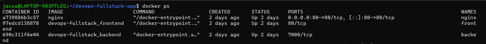

# 🚀 DevOps Full Stack Application

## 📌 Overview
This project demonstrates a complete **DevOps workflow** for a full-stack web application. It includes containerization using Docker, multi-service management with Docker Compose, and automated CI/CD pipeline using Jenkins to build and deploy the application efficiently.

---

## 🏗️ Architecture

The application follows a containerized multi-tier architecture:
```
Client
  ↓
Nginx (Reverse Proxy)
  ↓
Frontend Service (UI)
  ↓
Backend Service (API)
```
- **Client** interacts with the application via browser.
- **Nginx** acts as a reverse proxy, routing requests to appropriate services.  
- **Frontend** serves the user interface and communicates with backend APIs.  
- **Backend** handles business logic and processes user data.

---

## 🛠️ Tech Stack

- **Frontend:** HTML, JavaScript  
- **Backend:** Node.js (Express)  
- **Containerization:** Docker  
- **Orchestration:** Docker Compose  
- **Reverse Proxy:** Nginx  
- **CI/CD:** Jenkins  

---

## ⚙️ Features

- Add user (username & email)  
- View users  
- REST API integration  
- Multi-container deployment  
- Automated CI/CD pipeline  

---

## 📂 Project Structure

```
devops-fullstack-app/
├── frontend/
├── backend/
├── nginx/
├── screenshots/
├── docker-compose.yml
├── Jenkinsfile
└── README.md
```

---

## 🚀 Getting Started

### Clone Repository
```
git clone https://github.com/RohiniJ1204/devops-fullstack-app.git
cd devops-fullstack-app
```

### Run Application
```
docker-compose up --build
```

### Access Application
```
http://localhost
```

---

## 🔁 CI/CD Pipeline

This project implements a Continuous Integration and Continuous Deployment (CI/CD) pipeline using Jenkins to automate the build and deployment process.

### Workflow

1. Code is pushed to GitHub repository.  
2. Jenkins pipeline is triggered manually (or via webhook).  
3. Jenkins pulls the latest source code.
4. Docker images are built using Docker Compose.  
5. Existing containers are stopped and removed.
6. Updated containers are deployed automatically.  

### Pipeline Stages

- **Checkout:** Fetch latest code from repository.  
- **Build:** Build Docker images using `docker-compose build`.  
- **Deploy:** Stop old containers and start new ones using `docker-compose up -d`. 

### Outcome

This pipeline ensures:
- Faster and consistent deployments.  
- Reduced manual intervention.
- Reliable and repeatable build process.

---

## 📸 Screenshots

### Application UI


### Application users


### Jenkins Pipeline Success


### Pipeline Execution Logs


### Running Containers

  
---

## 🧠 Key Learnings

- Gained hands-on experience in building and containerizing a full-stack application using Docker.  
- Implemented a CI/CD pipeline using Jenkins to automate build and deployment processes.
- Managed multi-container architecture using Docker Compose.
- Configured Nginx as a reverse proxy to route requests between services.  
- Understood the complete DevOps workflow from development to deployment. 
- Troubleshot real-world issues such as Docker permission errors and pipeline failures.  
- Improved debugging and problem-solving skills in a DevOps environment.

---

## 🚀 Future Improvements

- Deploy the application on cloud platforms such as AWS or GCP.
- Implement container orchestration using Kubernetes for scalability.
- Integrate a database (e.g., MongoDB or MySQL) for persistent storage.    
- Add monitoring and logging tools (e.g., Prometheus, Grafana).  

---

## 👩‍💻 Author

**Rohini Javvaji**

DevOps Enthusiast
